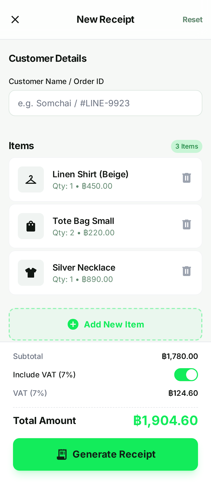
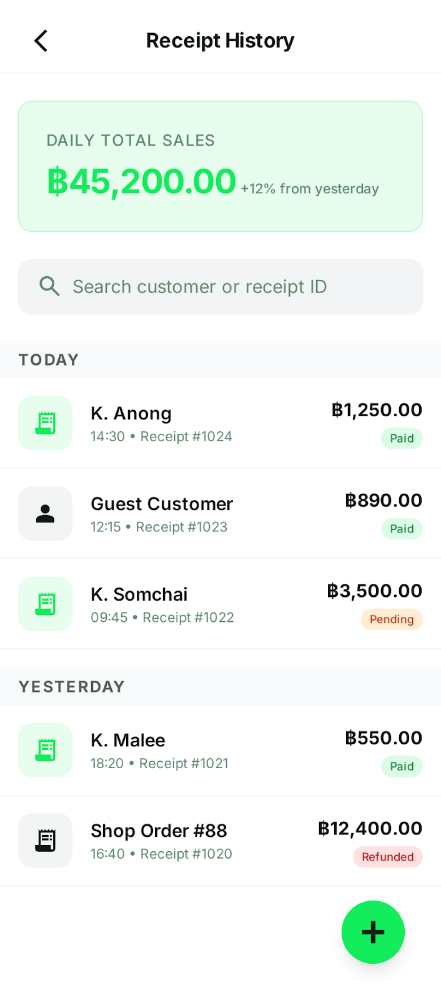

# 🧾 BillSnap

**A modern mobile receipt and billing app for Thai small businesses.**

Generate professional receipts, accept PromptPay payments, and manage your shop inventory - all from your phone. Built with React Native and designed for real-world use by street vendors, cafés, and small shops across Thailand.

---

## 📱 Features

### 🚀 Dual Operating Modes

**Quick Mode** - For street vendors and fast sales
- Single-tap transactions
- Just enter the total amount
- Instant PromptPay QR generation
- No itemization needed

**Full Mode** - For detailed receipts
- Itemized receipts with quantities
- Customer names and notes
- Automatic VAT calculation (7%)
- Professional thermal-style formatting

### ✨ Core Capabilities

- 🧾 **Thai-Style Receipts** - Authentic thermal printer aesthetics
- 💰 **PromptPay Integration** - Generate QR codes for instant payment
- 📊 **Sales Analytics** - Track revenue, receipts, and bestsellers
- 🏪 **Inventory Management** - Save preset items for quick entry
- 🌐 **Bilingual** - Full Thai and English support
- 📱 **Share Receipts** - Via LINE, WhatsApp, or save to gallery
- 🔒 **Secure** - OAuth authentication + encrypted storage
- 📡 **Offline Support** - Works without internet, syncs when online
- 🎨 **11 Store Types** - Pre-configured for different business types

---

## 📸 Screenshots

<div align="center">
  
  
</div>

*Professional receipts with Thai thermal printer styling*

---

## 🛠️ Tech Stack

**Frontend**
- React Native 0.81.5
- Expo ~54.0
- TypeScript 5.9 (strict mode)
- Expo Router (file-based navigation)

**Backend & Services**
- Supabase (PostgreSQL + Auth + RLS)
- PostHog (analytics)
- PromptPay QR generation

**Key Libraries**
- `@supabase/supabase-js` - Database client
- `expo-auth-session` - OAuth flows
- `expo-secure-store` - Encrypted token storage
- `react-native-view-shot` - Receipt image generation
- `expo-sharing` - Native share integration

**Development**
- Playwright (E2E testing)
- EAS Build (cloud builds)
- GitHub Actions (CI/CD)

---

## 🚀 Getting Started

### Prerequisites

- Node.js 18+ and npm
- Expo CLI (`npm install -g expo-cli`)
- iOS Simulator (Mac) or Android Emulator
- Supabase account (free tier works)

### Installation

```bash
# Clone the repository
git clone https://github.com/YOUR_USERNAME/billsnap.git
cd billsnap

# Install dependencies
npm install

# Create environment file
cp .env.example .env.local

# Add your Supabase credentials to .env.local
# EXPO_PUBLIC_SUPABASE_URL=https://xxx.supabase.co
# EXPO_PUBLIC_SUPABASE_ANON_KEY=your-anon-key
```

### Database Setup

```bash
# 1. Create a Supabase project at https://supabase.com

# 2. Run migrations from supabase/migrations/ in order:
#    - 20240118000000_initial_schema.sql
#    - 20240119000000_add_shop_mode_and_onboarding.sql
#    - 20240119000001_schema_fixes.sql

# 3. Enable Row Level Security (RLS) on all tables
# 4. Add RLS policies (see TECHNICAL_OVERVIEW.md)
```

### Run the App

```bash
# Start Expo development server
npm start

# Run on iOS simulator (Mac only)
npm run ios

# Run on Android emulator
npm run android

# Run on web (for testing only)
npm run web
```

### Run Tests

```bash
# Run E2E tests with Playwright
npm test

# Run tests with UI
npm test:ui

# Run mobile-specific tests
npm test:mobile
```

---

## 📁 Project Structure

```
billsnap/
├── app/                    # Expo Router screens
│   ├── (auth)/            # Login & shop setup
│   ├── (tabs)/            # Main app (home, receipts, items, stats, settings)
│   ├── _layout.tsx        # Root layout with auth
│   └── onboarding.tsx     # First-time user flow
├── components/            # Reusable UI components
│   ├── ui/               # Design system components
│   ├── stats/            # Analytics components
│   └── *.tsx             # Feature components
├── lib/                   # Business logic
│   ├── auth/             # Authentication
│   ├── hooks/            # Custom React hooks
│   ├── i18n/             # Translations (Thai/English)
│   └── *.ts              # Utilities (receipt, share, validation, etc.)
├── types/                 # TypeScript definitions
├── supabase/              # Database migrations
└── tests/                 # E2E tests
```

---

## 🎯 Key Features Explained

### Receipt Generation

BillSnap generates authentic Thai-style thermal receipts that can be shared as images:

```typescript
// Generate receipt image
const receiptRef = useRef<View>(null);
await captureReceipt(receiptRef);

// Share via LINE, WhatsApp, etc.
await captureAndShare(receiptRef);

// Save to gallery
await captureAndSave(receiptRef);
```

### PromptPay QR Codes

Generate payment QR codes using Thai PromptPay standard:

```typescript
import generatePayload from 'promptpay-qr';

// Phone number or Citizen ID
const payload = generatePayload('0812345678', {
  amount: 240.75
});

// Renders as QR code - customer scans to pay
```

### Offline Queue

Operations are queued when offline and automatically synced when connection returns:

```typescript
// Automatically queued if offline
await createReceipt(receiptData);

// Syncs automatically when online
await processQueue();
```

### Multi-Language Support

Seamlessly switch between Thai and English:

```typescript
const { t, setLanguage } = useLanguage();

// Automatic device language detection
// Manual switching in settings
// All UI strings translated
```

---

## 🏗️ Architecture Highlights

### Type-Safe Navigation

Using Expo Router's file-based routing:

```typescript
// Type-safe navigation
router.push('/receipt/123');
router.push({
  pathname: '/edit-shop',
  params: { shopId: '123' }
});
```

### Custom Hooks Pattern

Clean separation of business logic:

```typescript
// lib/hooks/useReceipts.ts
export function useReceipts(shopId: string) {
  return {
    receipts,      // Latest receipts
    loading,       // Loading state
    error,         // Error state
    createReceipt, // Create function
    deleteReceipt, // Delete function
    refreshReceipts // Manual refresh
  };
}
```

### Row Level Security

Database-level authorization with Supabase RLS:

```sql
-- Users can only access their own data
CREATE POLICY "Users can view own receipts"
  ON receipts FOR SELECT
  USING (
    shop_id IN (
      SELECT id FROM shops WHERE user_id = auth.uid()
    )
  );
```

---

## 🔒 Security

- ✅ **OAuth Authentication** - Google Sign-In via Expo Auth Session
- ✅ **Encrypted Storage** - Tokens stored in iOS Keychain / Android Keystore
- ✅ **Row Level Security** - Database policies enforce access control
- ✅ **Input Validation** - PromptPay ID format validation
- ✅ **No Hardcoded Secrets** - Environment variables only
- ✅ **0 NPM Vulnerabilities** - All dependencies audited

See `SECURITY_REVIEW.md` for full security audit.

---

## 📊 Code Quality

| Metric | Score |
|--------|-------|
| **Lines of Code** | ~6,000 |
| **Type Coverage** | 95%+ |
| **Security Rating** | B+ (88/100) |
| **Code Quality** | 7.5/10 |
| **Production Readiness** | 9.1/10 |
| **Architecture** | A- (85/100) |
| **NPM Vulnerabilities** | 0 |

**Key Stats:**
- TypeScript strict mode enabled
- 50+ try-catch blocks for error handling
- Comprehensive i18n (100+ translation keys)
- E2E test coverage with Playwright
- All console.logs guarded with `__DEV__`

See detailed reviews in:
- `CODE_QUALITY_REVIEW.md`
- `PRODUCTION_REVIEW.md`
- `ARCHITECTURE_REVIEW.md`
- `TECHNICAL_OVERVIEW.md`

---

## 🧪 Testing

```bash
# Run all tests
npm test

# Run with UI for debugging
npm test:ui

# Run specific test file
npx playwright test tests/receipts.spec.ts

# Run mobile viewport tests only
npm test:mobile
```

**Test Coverage:**
- E2E tests for critical user flows
- Authentication flow testing
- Receipt creation and sharing
- Mobile-first viewport testing (360px)

---

## 🚢 Deployment

### Build for Production

```bash
# Install EAS CLI
npm install -g eas-cli

# Configure EAS
eas build:configure

# Build for iOS
npm run build:prod
eas build --platform ios

# Build for Android
eas build --platform android

# Submit to App Store
npm run submit:ios

# Submit to Play Store
npm run submit:android
```

### Environment Variables

Required for production:

```bash
EXPO_PUBLIC_SUPABASE_URL=https://xxx.supabase.co
EXPO_PUBLIC_SUPABASE_ANON_KEY=your-anon-key
EXPO_PUBLIC_POSTHOG_API_KEY=your-key (optional)
```

---

## 🌏 Internationalization

BillSnap is fully bilingual with Thai and English support:

- **Automatic language detection** based on device settings
- **Manual language switching** in app settings
- **100+ translated strings** covering all UI text
- **Date/time localization** using Thai Buddhist calendar
- **Currency formatting** (THB ฿)

```typescript
// lib/i18n/translations.ts
export const translations = {
  welcome: { en: 'Welcome', th: 'ยินดีต้อนรับ' },
  create_receipt: { en: 'Create Receipt', th: 'สร้างใบเสร็จ' },
  // ...100+ more keys
};
```

---

## 🤝 Contributing

This is a portfolio project, but feedback and suggestions are welcome!

1. Fork the repository
2. Create a feature branch (`git checkout -b feature/amazing-feature`)
3. Commit your changes (`git commit -m 'Add amazing feature'`)
4. Push to the branch (`git push origin feature/amazing-feature`)
5. Open a Pull Request

---

## 📄 License

This project is licensed under the MIT License - see the [LICENSE](LICENSE) file for details.

---

## 👨‍💻 Author

**Your Name**
- GitHub: [@yourusername](https://github.com/yourusername)
- LinkedIn: [your-linkedin](https://linkedin.com/in/your-linkedin)
- Website: [yourwebsite.com](https://yourwebsite.com)

---

## 🙏 Acknowledgments

- **Expo Team** - For the amazing React Native framework
- **Supabase** - For the excellent PostgreSQL backend
- **Thai PromptPay** - For the payment QR standard
- **React Native Community** - For the incredible ecosystem

---

## 📚 Additional Documentation

- **[TECHNICAL_OVERVIEW.md](TECHNICAL_OVERVIEW.md)** - Deep dive into architecture & implementation
- **[CODE_QUALITY_REVIEW.md](CODE_QUALITY_REVIEW.md)** - Code quality analysis
- **[SECURITY_REVIEW.md](SECURITY_REVIEW.md)** - Security audit report
- **[PRODUCTION_REVIEW.md](PRODUCTION_REVIEW.md)** - Production readiness checklist
- **[ARCHITECTURE_REVIEW.md](ARCHITECTURE_REVIEW.md)** - Architecture assessment

---

## ⭐ Show Your Support

If you found this project interesting or useful for learning, please give it a star! ⭐

---

<div align="center">
  <strong>Built with ❤️ for Thai small businesses</strong>
  <br />
  <sub>React Native · TypeScript · Supabase · Expo</sub>
</div>
